# :anchor:JLinkV9制作:anchor:

## :1st_place_medal:效果图:framed_picture:

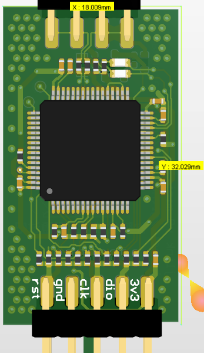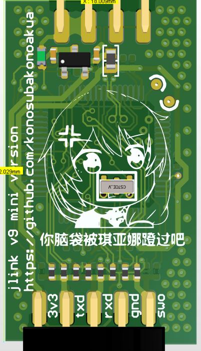

上图是ad渲染图，实际效果如下

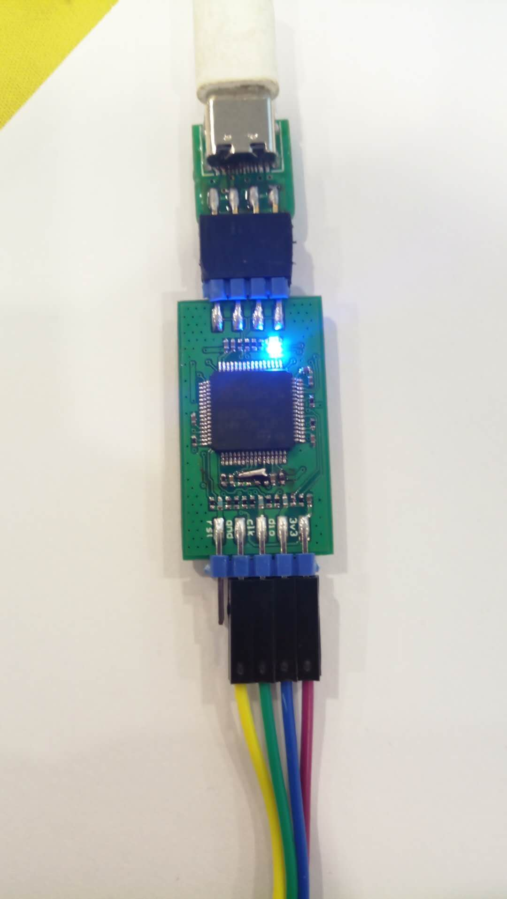

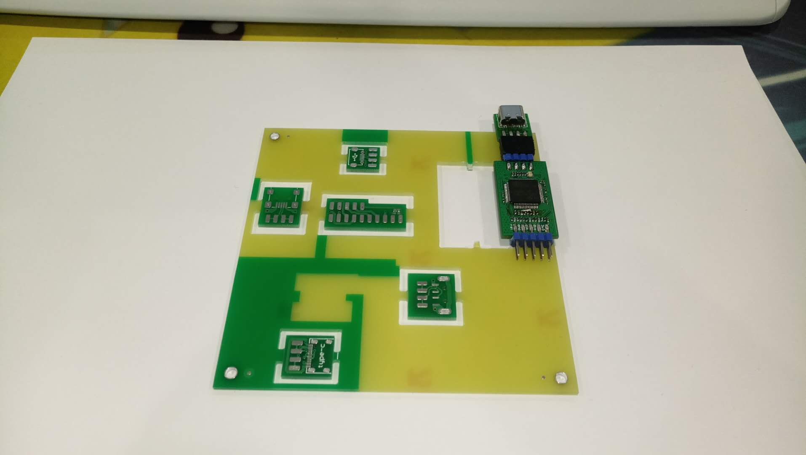

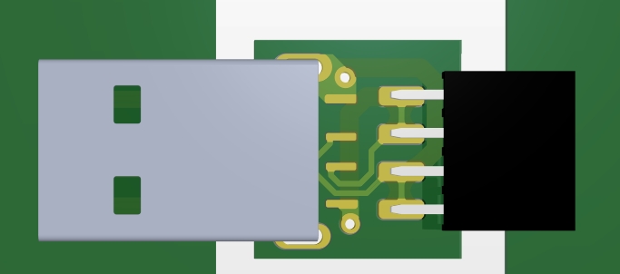

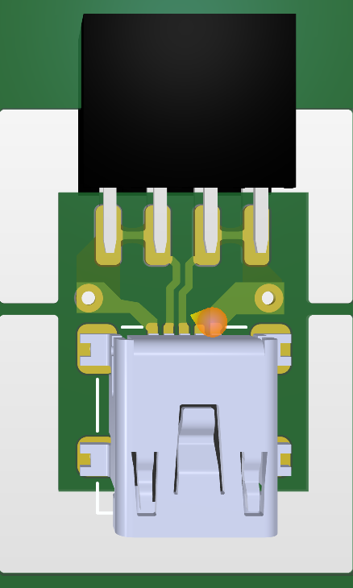

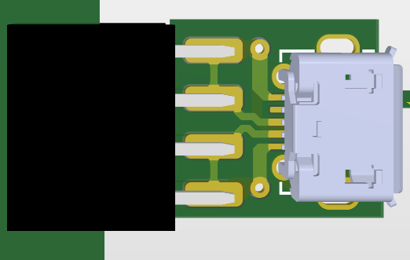

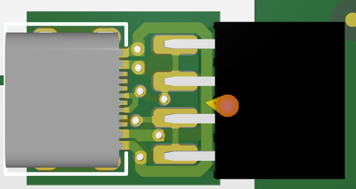

工程文件在压缩包里

------

## :2nd_place_medal:制作步骤:artificial_satellite:

- 焊接(手焊大概半个小时，建议使用刀头老铁焊接，尖头的话0402手太抖就🐶die)

- 写入bootloader，怎么写入就不废话了

- 在J-Link Commonder里面添加S/N后, 添加Licenses

- :congratulations:**完成**:congratulations:

  

  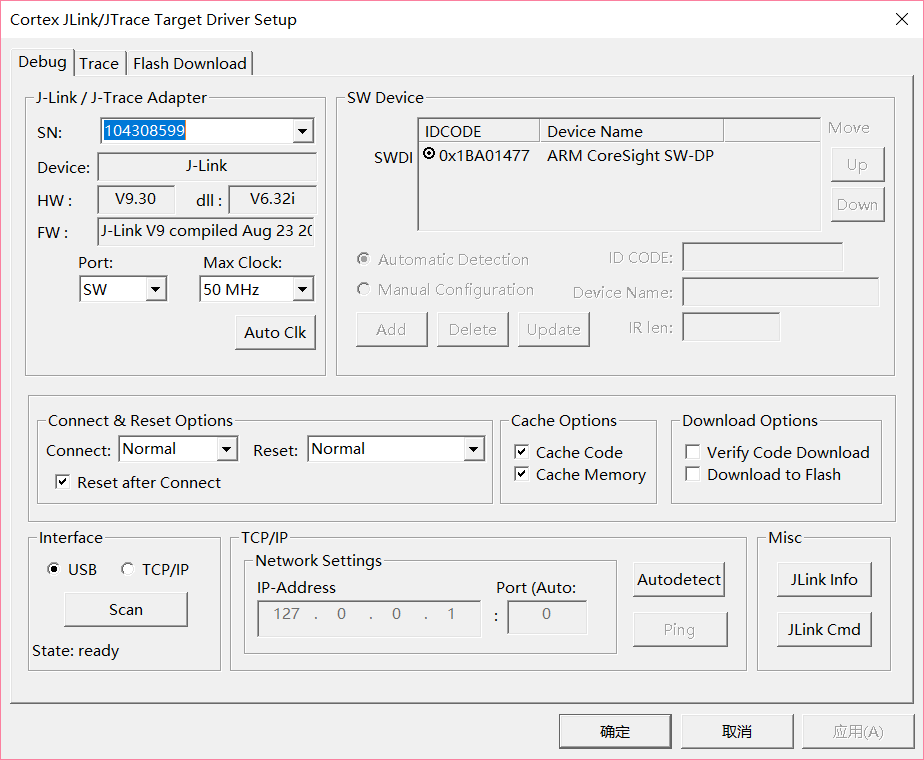

  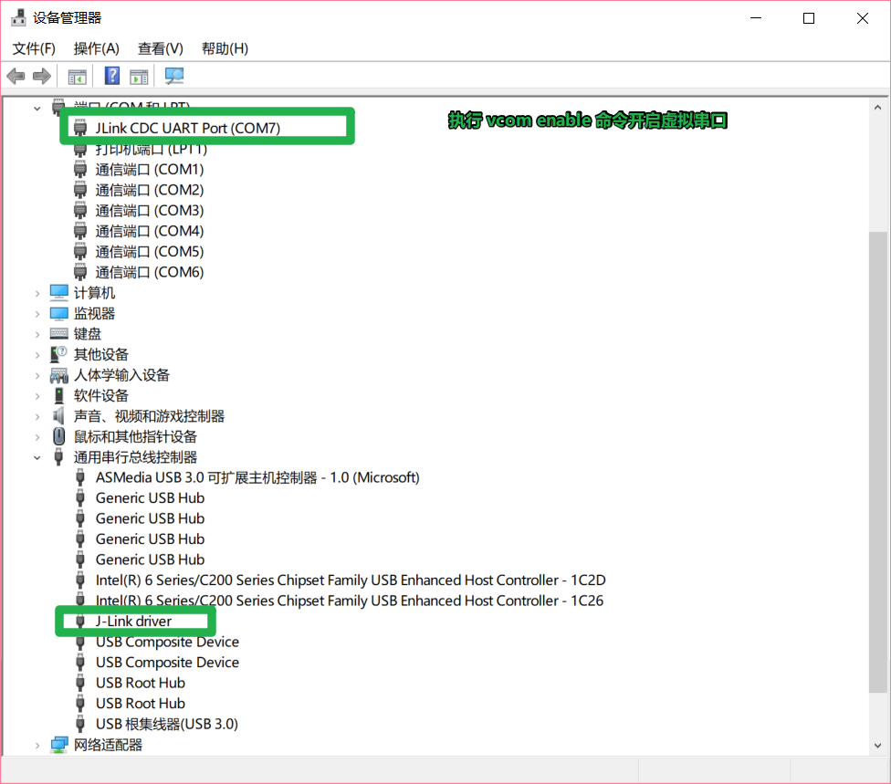

## :3nd_place_medal:更新
之前使用多种USB接口+排针的方式，实际使用中拔插次数多了可能会导致接触不良，
故更新一版只有typec接口的，PCB文件是`jlinkv9_only_usbc.PcbDoc` 效果如下（嘉立创🐂🍺，哑光黑不要钱）：

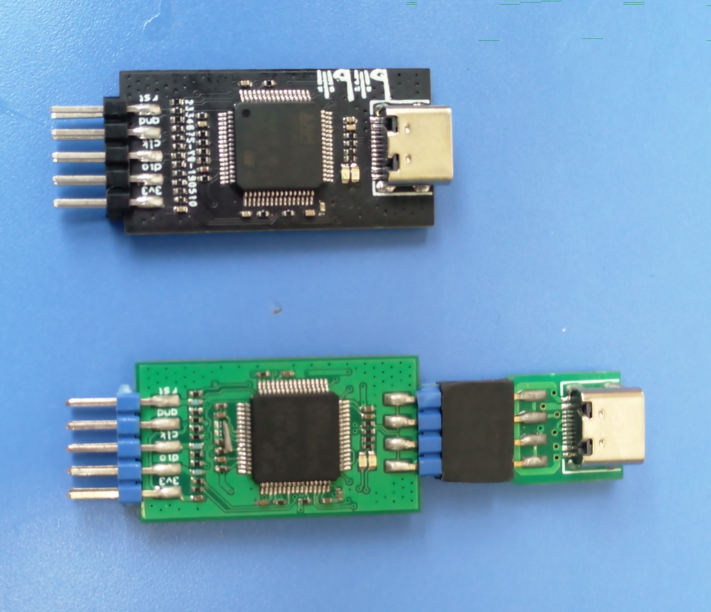

