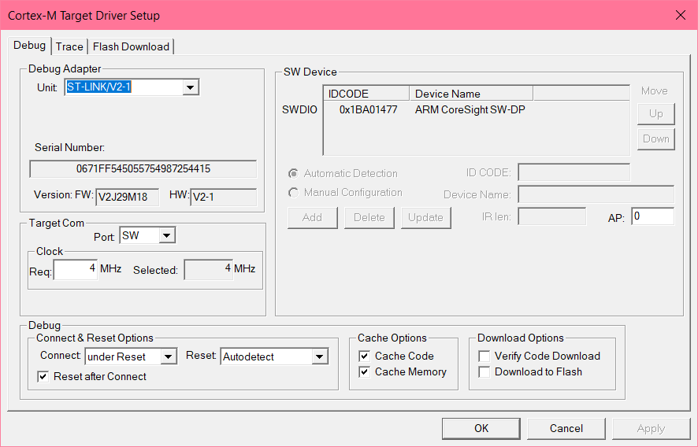
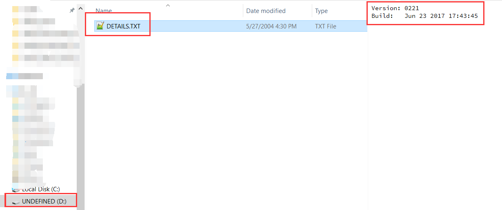
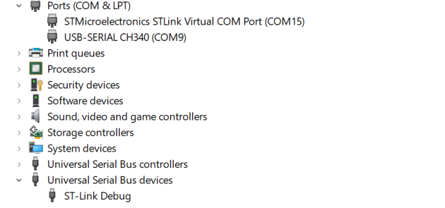
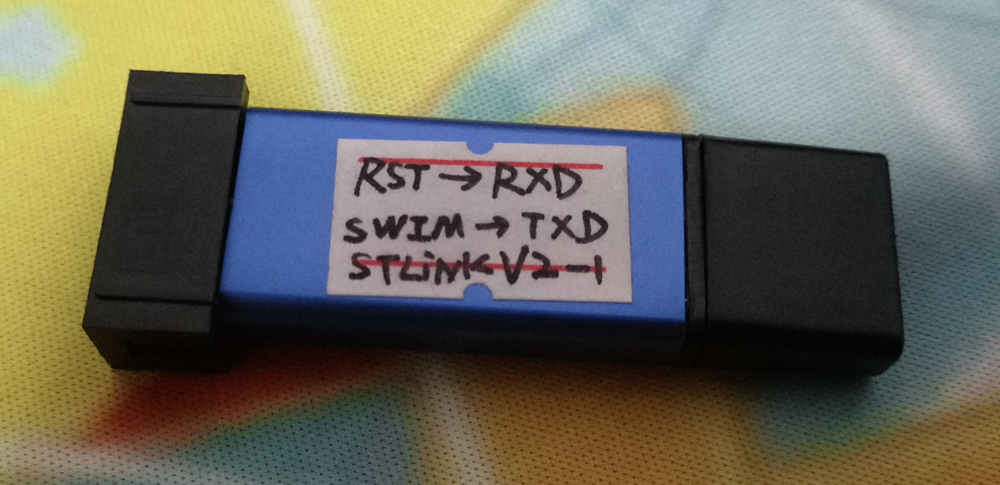
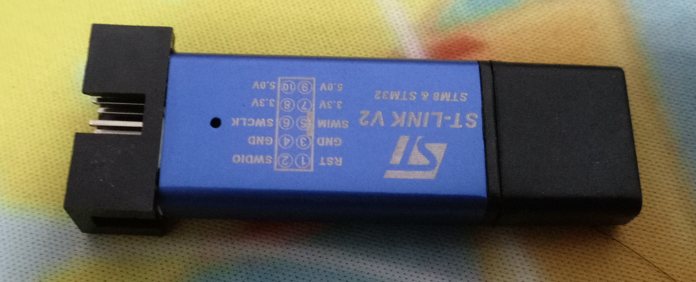

> ### 制作步骤及其简单
>
> - 弄断（随便你怎么弄）SWIM端口和RST端口和PCB之间的连线
>
> - 将STM32的PA2，PA3跳线连接到SWIM和RST
>
> - 用另外一个STLINK 以SWD方式连接到要魔改的STLINK
>
> - 使用STLINK UTILITY解锁写保护并且擦除芯片内容
>
> - 刷入bin文件（bootloader）
>
> - 使用STLINK UTILITY的Firmware Update自动升级固件
>
> - 开始使用STILNK V2-1
>
>   附几张刷写成功的图
>
>   
>
>   
>
>   
>
>   
>
>   
>
>   

